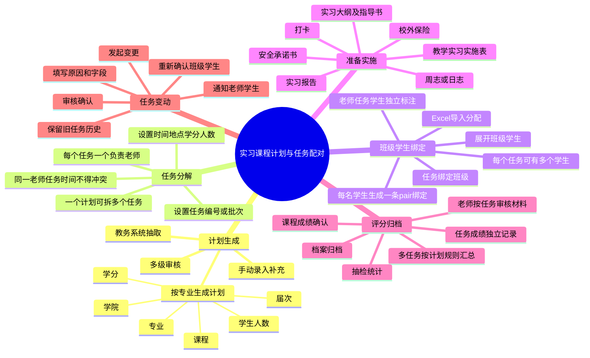
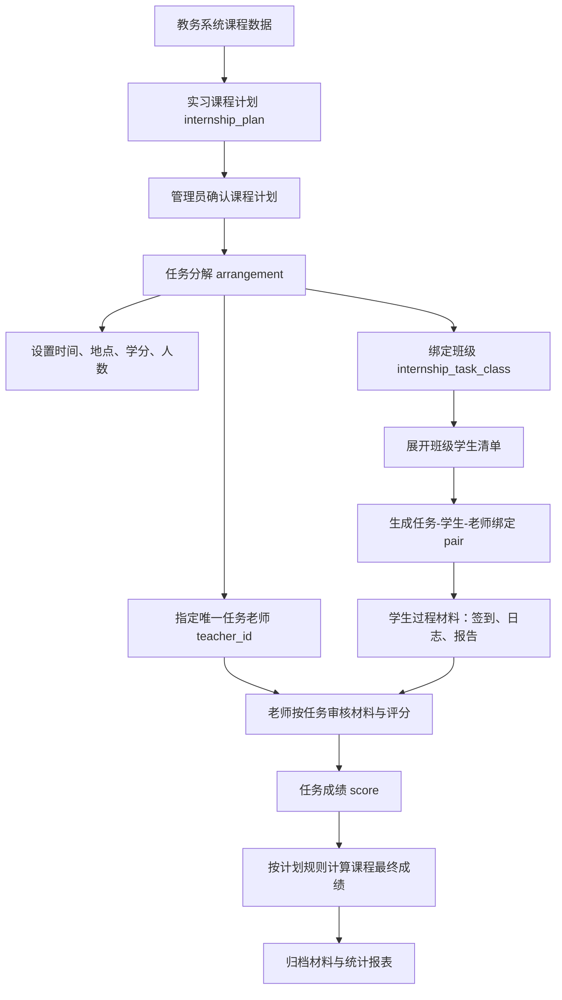
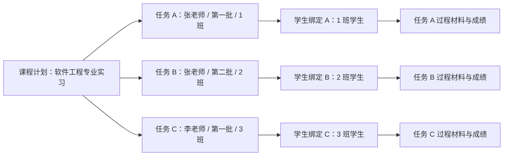
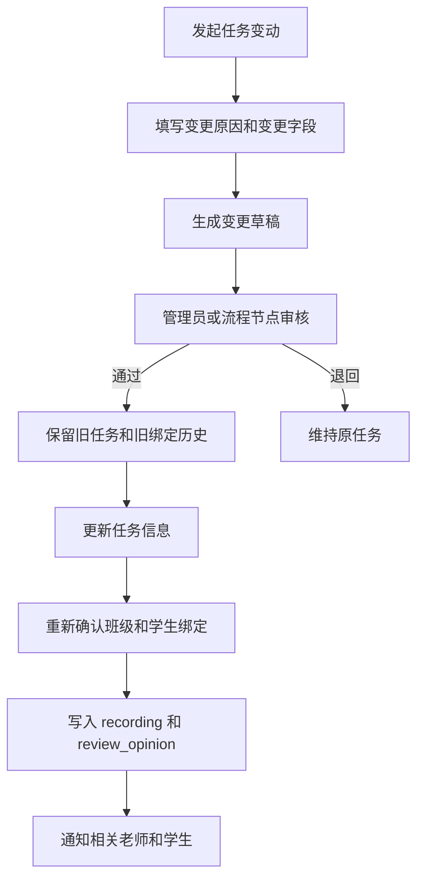

# 实习管理模块设计

## 1. 数据模型

> 所有表位于所属学校数据库中，无需 school_id 字段。

```
base（实习基地）
  - id, uuid, company_id
  - name, address, capacity, used_count
  - status
  - created_at, updated_at, deleted_at

base_profession_direction（基地-专业方向关联）
  - id
  - base_id（关联 base.id）
  - profession_id（关联 profession.profession_id）
  - direction_id（关联 profession_direction.direction_id；0 表示该专业全部方向）
  - created_at, updated_at, deleted_at

  **唯一约束：** `(base_id, profession_id, direction_id)`，防止同一基地重复配置相同专业方向。

enterprise_mentor（企业导师）
  - id, uuid
  - company_id（关联 companies.company_id）
  - name（姓名）
  - phone（联系电话）
  - position（职务）
  - created_at, updated_at, deleted_at

internship_plan（实习课程计划）
  - id, uuid
  - source_type: edu_system / manual（教务系统抽取或手动录入）
  - course_code, course_name（课程代码、课程名称）
  - grade_id, dep_id, profession_id（届次、学院、专业）
  - credit（课程学分）
  - student_count（计划学生人数）
  - score_rule: average / sum / weighted / manual（多任务成绩计算规则）
  - plan_content（JSON，教务抽取原始信息和计划说明快照）
  - status: draft / wait / accept / modify / enabled / disabled
  - submitter_id（提交人 account.id）
  - created_at, updated_at, deleted_at

arrangement（实习任务安排）
  - id, uuid, plan_id, base_id
  - teacher_id（任务唯一负责教师，关联 teacher_list.teacher_id）
  - task_no / batch_no（任务编号或批次编号）
  - type: cognition_internal / cognition_external / major_internal / major_external / production / graduation
  - organize_mode: centralized / distributed / autonomous（组织方式）
  - credit（本任务学分，可默认继承计划学分）
  - student_count（本任务计划学生人数）
  - title, start_date, end_date
  - location, description
  - status
  - created_at, updated_at, deleted_at

  **约束：** 每个任务只能对应一个老师；同一老师可承担多个任务，但同一老师的任务时间段不得冲突。一个 `internship_plan` 可拆分为多个 `arrangement` 任务。

internship_task_class（任务-班级绑定）
  - id, uuid
  - arrangement_id（关联实习任务）
  - grade_id, dep_id, profession_id, class_id
  - student_count_snapshot（绑定时班级学生人数快照）
  - status: active / removed
  - created_at, updated_at, deleted_at

  **唯一约束：** `(arrangement_id, class_id)`，防止同一任务重复绑定同一班级。

pair（任务-学生-老师绑定，三模块统一）
  - id, uuid, student_id（关联 students.student_id）, teacher_id（关联 teacher_list.teacher_id）
  - dep_id（院系，配对所属院系上下文）
  - second_teacher_id（第二指导教师，可选，特殊场景使用）
  - enterprise_mentor_id（企业导师 ID，可选，关联 enterprise_mentor.id，仅校外实习）
  - arrangement_id（关联的实习任务/实训项目/实验项目 ID）
  - type: internship / training / lab
  - application_id（可选，关联申请或调整来源）
  - status: active / removed（removed 表示已解除配对）
  - active_flag（生成列：status='active' 且 deleted_at IS NULL 时为 1，否则为 NULL）
  - remove_reason（解除配对理由）
  - is_anonymous: false / true（匿名评阅标记，默认 false）
  - created_at, updated_at, deleted_at

  **唯一约束：** `(student_id, type, arrangement_id, active_flag)` 确保同一学生在同一任务/项目下只有一条 active 绑定，防止重复绑定。removed 或软删除记录的 active_flag 为 NULL，允许保留历史解除记录并重新建立 active 绑定。

  **MySQL 生成列：** `active_flag TINYINT GENERATED ALWAYS AS (CASE WHEN status = 'active' AND deleted_at IS NULL THEN 1 ELSE NULL END) STORED`

student_join_teacher（学生选导师预留中间表）
  - id, uuid
  - student_id, teacher_id
  - application_id（关联 application 表）
  - application_type: internship / training / lab
  - application_status: applying / accept / refuse
  - is_anonymous: false / true（默认 false）
  - student_name, student_num（冗余，方便查询）
  - teacher_name（冗余）
  - created_at, updated_at, deleted_at

  **说明：** 当前实习主流程按“计划 → 任务 → 老师 → 班级/学生绑定”执行，`student_join_teacher` 不作为主配对链路。若后续恢复学生自主选导师，可作为选导申请中间表。

application（实习申请）
  - id, uuid, student_id, arrangement_id
  - type: centralized / distributed / autonomous
  - status: draft / wait / accept / modify
  - teacher_status: pending / accept / modify / skipped
  - admin_status: pending / accept / modify
  - materials（附件，关联 file_relation）
  - remark
  - created_at, updated_at, deleted_at

  **说明：** `application` 不作为当前实习主配对入口。主配对由 `internship_plan → arrangement → internship_task_class → pair` 完成；`application` 仅用于分散、自主等需学生补充申请材料的场景，且必须绑定到已发布的具体实习任务 `arrangement`。

sign_in（签到，支持三模块复用）
  - id, uuid, student_id
  - entity_type: internship / training / lab
  - entity_id（关联 arrangement_id / training_project_id / lab_project_id）
  - date
  - sign_time
  - sign_type: gps / qrcode / manual
  - location
  - remark
  - created_at, updated_at, deleted_at

sign_in_qrcode（签到二维码）
  - id, uuid, base_id（实习基地）/ room_id（实训室/实验室）
  - entity_type: internship / training / lab
  - token（二维码标识，唯一）
  - expire_at（过期时间）
  - created_by（生成人）
  - created_at, updated_at, deleted_at

journal（日志，支持三模块复用）
  - id, uuid, student_id
  - entity_type: internship / training / lab
  - entity_id
  - title, content, date
  - images（关联 file_relation）
  - status: draft / wait / accept / modify
  - teacher_id（最近评阅教师，快捷引用；详细评阅记录见 review_opinion）
  - created_at, updated_at, deleted_at

report（报告）
  - id, uuid, student_id, arrangement_id, template_id
  - title, content
  - attachments（关联 file_relation）
  - status: draft / wait / accept / modify
  - teacher_id（最近评阅教师，快捷引用；详细评阅记录见 review_opinion）
  - submitted_at, reviewed_at
  - created_at, updated_at, deleted_at

report_template（报告模板）
  - id, uuid
  - name, content, version
  - online_enabled: false / true（是否启用在线填写）
  - form_schema（JSON，在线填写的表单字段定义，online_enabled=true 时有效）
  - status
  - created_at, updated_at, deleted_at

score（成绩）
  - id, uuid, student_id, arrangement_id
  - sign_in_score, journal_score, report_score
  - sign_in_weight, journal_weight, report_weight
  - enterprise_score（企业/实习单位评分，仅毕业实习 graduation 需要）
  - enterprise_comment（企业评语，TEXT）
  - final_score, teacher_id, comment
  - created_at, updated_at, deleted_at

  **说明：** `score` 记录任务成绩。若一个实习课程计划拆分为多个任务，同一学生会在多个 `arrangement_id` 下分别产生任务成绩，最终课程成绩按 `internship_plan.score_rule` 计算。

review_opinion（评阅意见，统一表）
  - id, uuid
  - entity_type: application / journal / report / delay / training_material / training_report / lab_material / lab_report
  - entity_id（关联对应业务主表 id）
  - recording_id（可选，关联对应 _recording 子表 id）
  - teacher_id（评阅人）
  - opinion（评语/意见）
  - score（评分，可选）
  - status: accept / modify（通过或退回修改）
  - created_at, updated_at, deleted_at

# recording 子表族（通用模式，各主表对应一个 _recording 表）
application_recording / journal_recording / report_recording / join_recording / apply_report_delay_recording
  - id
  - parent_id（关联主表 id）
  - action: submit / review / accept / modify / refuse / ...
  - operator_id（操作人）
  - content（操作内容描述）
  - created_at（仅创建时间，不可修改，确保时间线不可篡改）
```

**说明：** 实习主链路以 `internship_plan` 为课程计划，以 `arrangement` 为具体任务，以 `internship_task_class` 和 `pair` 建立“任务-班级-学生-老师”关系。日志、报告、签到、成绩均通过 `arrangement_id` 绑定到具体任务，避免同一老师不同任务、不同班级或不同批次混淆。

## 2. 实习计划与任务流程

### 2.1 主流程

```
1. 实习计划生成
   - 管理员从教务系统抽取课程数据生成实习课程计划。
   - 计划按专业制定，包含课程、学分、届次、学院、专业、学生人数等基础信息。

2. 任务分解与分配
   - 管理员将一个计划拆分为一个或多个具体任务。
   - 每个任务包含唯一老师、时间、地点、学分、学生人数、任务编号或批次号。
   - 一个老师可承担多个任务，但同一老师的任务时间段必须错开。

3. 学生与班级绑定
   - 管理员将任务绑定到具体班级。
   - 系统按班级展开学生清单，生成每个学生的任务绑定记录。
   - 同一老师不同任务绑定的班级和学生必须独立展示，不能合并为一个指导关系。

4. 执行、材料与评分
   - 学生按任务提交签到、日志、报告等过程材料。
   - 任务老师按任务查看绑定学生，审核材料并录入任务成绩。
   - 学生参与多个任务时，成绩按任务分别记录，最终课程成绩由计划中的计算规则决定。

5. 任务变动
   - 任务老师、班级、时间、地点、学分、人数发生调整时，必须走变更确认流程。
   - 变更通过后保留旧任务和旧绑定历史，重新确认任务与学生绑定关系。
```

### 2.2 实习计划任务思维导图



### 2.3 数据流流程图



### 2.4 老师-任务-学生关系图



**说明：** 同一老师承担多个任务时，必须以任务为边界分别展示和处理。老师端列表默认按任务筛选学生，避免不同批次、不同班级的学生混在一起。

### 2.5 任务变动确认流程图



## 3. 状态流转与审核规则

### 3.1 计划状态

```
draft → wait → accept
草稿    待审核   已通过

wait → modify → wait
退回修改后重新提交
```

### 3.2 任务状态

```
draft → enabled → completed
草稿    已发布     已完成

enabled → changing → enabled
变更确认中，通过后重新发布
```

### 3.3 审核规则

| 规则 | 说明 |
|---|---|
| 计划来源 | 优先从教务系统抽取，人工录入作为补充 |
| 计划粒度 | 按专业制定，直接关联课程 |
| 任务粒度 | 一个计划可拆分多个任务，每个任务唯一对应一个负责老师 |
| 时间校验 | 同一老师多个任务的时间段不得冲突 |
| 学生绑定 | 任务先绑定班级，再展开学生集合；一个任务可对应多个学生，每名学生生成一条任务级 `pair` 绑定 |
| 数据边界 | 老师只能处理自己任务下绑定的学生 |
| 变更留痕 | 任务老师、时间、地点、班级、学生范围变动必须记录原因和审核意见 |
| 通知触发 | 计划通过、任务发布、任务变更、成绩发布均触发消息通知 |

### 3.4 与完整实习流程衔接

参考现有《实习管理流程图》HTML，实习业务仍按五个阶段推进：

| 阶段 | 核心数据 | 说明 |
|---|---|---|
| 计划阶段 | internship_plan / arrangement / internship_task_class / pair | 从教务系统抽取课程计划，拆分任务，绑定老师、班级和学生。 |
| 准备阶段 | syllabus_guide / insurance / safety_letter_sign / implementation_sheet | 按专业维护大纲，完成校外保险、安全承诺和教学实习实施表。 |
| 实施阶段 | sign_in / journal / report | 学生按任务打卡、提交日志或周志，老师按任务审核。 |
| 总结阶段 | report / score / teacher_work_report | 学生提交报告，老师按任务评分，系统按课程计划汇总成绩。 |
| 归档阶段 | archive material / inspection_record / stat report | 按课程、任务和学生整理电子材料，支持抽检和统计。 |

## 4. 任务绑定与配对逻辑

### 4.1 绑定入口

实习模块不再把“选导师”和“学生报名”作为主配对方式。当前主流程只有管理员按计划任务进行分配：

- 管理员创建或导入实习课程计划。
- 管理员将计划拆分为任务。
- 管理员为每个任务指定唯一负责老师。
- 管理员为任务选择一个或多个班级，系统展开班级学生集合。
- 系统按学生生成 `pair` 绑定记录。

### 4.2 Excel 导入分配

管理员分配需支持 Excel 导入，建议模板字段：

| 字段 | 必填 | 说明 |
|---|---|---|
| 届次 | 是 | 匹配 grade_list |
| 学院 | 是 | 匹配 department |
| 专业 | 是 | 匹配 profession |
| 课程代码 | 否 | 从教务系统抽取时使用 |
| 课程名称 | 是 | 生成或匹配 internship_plan |
| 学分 | 是 | 写入计划和任务 |
| 任务编号 | 是 | 同一计划下唯一 |
| 批次 | 否 | 标识同一老师的不同任务 |
| 老师工号 | 是 | 优先匹配 teacher_list.teacher_num |
| 老师姓名 | 否 | 辅助核对 |
| 开始日期 | 是 | 任务开始时间 |
| 结束日期 | 是 | 任务结束时间 |
| 地点 | 是 | 任务执行地点 |
| 班级 | 是 | 可用逗号分隔多个班级 |
| 学生人数 | 否 | 用于导入核对，实际以展开学生数为准 |

导入规则：
- 先匹配或创建 `internship_plan`。
- 再按 `计划 + 任务编号` 匹配或创建 `arrangement`。
- 每行任务只能指定一个老师。
- 同一老师同一时间段已存在任务时，导入失败并返回行号。
- 班级已绑定同一任务时跳过，不重复生成。
- 绑定学生时同一学生、同一任务只能有一条 active `pair`。

### 4.3 学生自主选导师预留

若后续学校确认存在学生自主选导师场景，可恢复 `student_join_teacher` 作为志愿申请表，但不能与当前任务绑定主链路混用。恢复时需明确：
- 哪些计划允许学生选导师。
- 选导师是否仍需生成具体任务。
- 老师接受后是否自动生成任务，或只能绑定到管理员已发布任务。
- 选导容量与任务人数如何互相校验。

## 5. 签到

sign_in 表通过 entity_type + entity_id 支持实习/实训/实验三模块复用。

### 签到方式

| 方式 | 场景 | 说明 |
|---|---|---|
| GPS 定位 | 外勤签到 | 获取定位，与实习地点对比，超出范围标记异常 |
| 二维码 | 基地/实训室现场 | 教师/管理员生成动态二维码（写入 sign_in_qrcode 表），有效期可配置 |
| 手动签到 | 补签 | 教师/管理员后台代签，需备注原因 |

### 签到规则

- 每日需签到，签到时间段由配置设定
- GPS 签到需在基地指定半径内（可配置）
- 二维码有效期 5 分钟（可配置），定时刷新，token 唯一
- 超出签到时段未签 → 标记为缺勤
- 签到时段内签到 → 正常，时段外但在当天 → 迟到
- 教师可查看自己指导学生的签到记录
- 学院管理员可查看本院学生签到统计

## 6. 日志

journal 表通过 entity_type + entity_id 支持实习/实训/实验三模块复用。

- 学生每日或按周提交（频率可配置）
- 支持草稿和直接提交
- 教师可查看自己指导学生的日志
- 教师可点评（accept）或退回修改（modify）
- 退回后学生修改可重新提交
- 教师批量查看某日/某周日志，统一点评
- 日志可上传图片附件

## 7. 报告

- 实习结束前/后提交（截止时间可配置）
- 管理员配置报告模板，学生按模板填写
- 支持草稿和直接提交
- 教师评阅：评分 + 评语 → accept，或退回 modify
- 退回后学生修改重新提交
- 支持附件上传（Word/PDF 等）

### 7.1 在线编辑（预留）

管理员在报告模板中启用 `online_enabled=true` 并配置 `form_schema` 后，学生可在 PC/H5 端在线填写报告。

```
app/server/docgen/
└── DocGenService.php            # 文档生成服务

runtime/docgen/{database_id}/
├── template/
│   └── report.docx              # 基础 Word 模板（占位符替换）
└── output/                       # 生成产物（临时）
```

**在线填写流程：**

```
学生端：
  1. 打开报告页面 → 检测模板 online_enabled=true
  2. 按 form_schema 渲染表单（文本框、富文本、图片上传等）
  3. 填写内容，实时保存草稿
  4. 点击"生成报告" → 后端渲染
     → 将表单数据填入 Word 模板（占位符替换）
     → 生成 .docx → 同时转 .pdf
     → 写入 file 表（is_temporary=1）
     → 返回预览 URL
  5. 确认无误 → 提交（status=draft→wait）

教师端：
  1. 查看报告 → 在线预览 PDF
  2. 可下载 Word 和 PDF 版本
```

**form_schema 示例：**

```json
{
  "sections": [
    {
      "title": "实习基本情况",
      "fields": [
        {"key": "company_name", "label": "实习单位", "type": "text"},
        {"key": "start_date", "label": "开始日期", "type": "date"},
        {"key": "content", "label": "实习内容", "type": "richtext"}
      ]
    }
  ]
}
```

### 7.2 截止与延期

各阶段截止时间由配置项控制（可学院/个人覆盖）。截止后学生无法直接提交，需申请延期。

```
配置读取优先级：
  config_item(user_id=xxx, key=report_deadline)  → 个人延期覆盖
  config_item(college_id=yy, key=report_deadline) → 学院级默认
  config_item(key=report_deadline)                 → 系统默认
```

**延期流程：**

```
学生端：
  1. 截止时间已过 → 页面显示"已截止"，出现"申请延期"按钮
  2. 填写延期申请（期望日期 + 理由）
  3. 提交 → apply_report_delay（status=wait）

教师端：
  4. 查看延期申请列表
  5. 审核 → 选择延期截止日期
     ├→ accept → 写入 config_item(user_id=xxx, key=report_deadline, value=新日期)
     └→ refuse → 填写拒绝原因

学生端：
  6. 延期通过 → 页面恢复提交功能，截止日期更新
  7. 延期拒绝 → 显示拒绝原因
```

**deadline_extension 表：**

```
apply_report_delay（延期申请主表）
  - id, uuid
  - student_id
  - config_key（如 report_deadline / journal_deadline）
  - entity_type: internship / training / lab
  - entity_id（关联 arrangement_id / project_id）
  - requested_date（申请延至日期）
  - reason（延期理由）
  - status: wait / accept / refuse
  - created_at, updated_at, deleted_at

apply_report_delay_recording（延期申请时间线）
  - id, delay_id
  - action: submit / teacher_review / accept / refuse
  - operator_id（操作人）
  - content（操作内容/意见）
  - created_at
```

### 7.3 流程时间线（通用）

各阶段统一通过 recording 子表追踪全流程时间线，评阅意见统一存入 `review_opinion` 表。

**recording 表族：**

| 主表 | recording 子表 | 记录内容 |
|---|---|---|
| application | application_recording | 提交/审核/退回 |
| student_join_teacher | join_recording | 选择/审核/拒绝 |
| apply_report_delay | apply_report_delay_recording | 申请/审核/延期 |
| journal | journal_recording | 提交/点评/退回 |
| report | report_recording | 提交/评阅/退回 |

每条 recording 记录一次状态变更，形成完整时间线（谁、什么时间、做了什么）。

**review_opinion（评阅意见，统一表）：**

```
review_opinion
  - id, uuid
  - entity_type: application / journal / report / delay / training_material / training_report / lab_material / lab_report
  - entity_id（关联对应业务主表 id）
  - recording_id（可选，关联对应 recording 子表的 id）
  - teacher_id（评阅人）
  - opinion（评语/意见）
  - score（评分，可选）
  - status: accept / modify（通过或退回修改）
  - created_at, updated_at, deleted_at
```

**时间线查询示例（学生视角）：**

```
实习报告时间线：
  2026-05-20 14:30  学生 提交报告
  2026-05-21 09:15  教师 张三 评阅 → 退回修改（review_opinion: "格式请调整"）
  2026-05-21 16:00  学生 修改后重新提交
  2026-05-22 10:00  教师 张三 评阅 → 通过（review_opinion: "已达标", score: 85）
```

一条 recording 记录可对应一条 review_opinion，通过 `entity_type + recording_id` 关联，完整还原审核沟通链。实训/实验材料和报告未单独定义 recording 表时，通过 `entity_type + entity_id` 关联评阅意见。

**recording 表归档策略：** recording 表族随业务量持续增长，需定期归档：

```
当前届次及上一届次：保留在当前学校业务库，在线查询
超过两个届次的数据：按年归档到当前学校业务库 recording_archive_YYYY 表
归档后原表数据物理删除，减少业务库体积
归档数据仍可在 PC 端"历史归档"页面查询（查询走当前学校业务库归档表，始终不跨学校库）
```

归档定时任务：按学校配置执行，默认每年 7 月、12 月各执行一次。

```
recording_archive_YYYY（统一时间线归档表）
  - id
  - source_table（来源 recording 表名）
  - source_id（来源 recording.id）
  - parent_table（来源主表名）
  - parent_id（来源主表 id）
  - entity_type: application / journal / report / delay / join
  - entity_id
  - action
  - operator_id
  - content
  - snapshot_data（JSON，仅保存归档快照，不存储关系 ID 列表）
  - original_created_at
  - archived_at
```

## 8. 成绩

- 成绩组成：签到分 + 日志分 + 报告分 + 企业评分（仅毕业实习）
- 各项权重可配置（sign_in_weight / journal_weight / report_weight），存在 score 表中以便不同安排可使用不同权重
- 毕业实习额外需要实习单位评分（enterprise_score）+ 企业评语（enterprise_comment）
- final_score 由各项得分 * 权重自动计算
- `score` 按任务记录；同一学生参与多个任务时，每个任务单独评分。
- 课程最终成绩由 `internship_plan.score_rule` 决定：平均、累计、加权或人工核定。
- 毕业实习鉴定表 = score 表数据 + 实习单位盖章确认（学生打印后提交扫描件）
- 成绩支持导出

## 9. AI 辅助评阅（预留）

配置 ai.* 后，教师在审核日志/报告时可使用 AI 辅助。

```
教师审核报告页面 → 点击"AI 辅助评阅"
  → 后端将报告内容 + ai.system_prompt 发送 LLM
  → 返回 AI 评阅意见（结构/内容/格式/建议等维度）
  → 展示在教师评语框旁，教师可参考后自行填写
  → AI 意见不自动提交，仅为辅助参考
```

- 学校级配置 ai.* 作为默认值，学院可覆盖（配置模块三级覆盖机制）
- AI 调用异步执行，不阻塞审核页面
- 仅教师和学院管理员可用此功能
- 日志/报告内容仅发送必要字段，敏感学生信息脱敏

## 10. 实习类型

系统支持 6 种实习类型，与学校实习教学档案清单匹配：

| 类型 | arrangement.type | 说明 |
|---|---|---|
| 认识实习（校内） | cognition_internal | 校内参观、讲座、演示 |
| 认识实习（校外） | cognition_external | 校外企业参观 |
| 专业实习（校内） | major_internal | 校内专业实践 |
| 专业实习（校外） | major_external | 校外企业专业实践 |
| 生产实习 | production | 企业生产一线实习 |
| 毕业实习 | graduation | 毕业前综合实习 |

`arrangement.type` 字段改为上述 6 个值之一（替代原 centralized/distributed/autonomous）。原三种组织方式（集中/分散/自主）作为 `arrangement.organize_mode` 字段保留。

## 11. 实习课程计划与任务安排

### 11.1 数据模型

```
internship_plan（实习课程计划）
  - id, uuid
  - source_type: edu_system / manual
  - course_code, course_name
  - grade_id, dep_id, profession_id
  - credit
  - student_count
  - score_rule: average / sum / weighted / manual
  - plan_content（JSON，保存教务系统原始信息和人工补充说明）
  - status: draft / wait / accept / modify / enabled / disabled
  - submitter_id（提交人 account.id）
  - created_at, updated_at, deleted_at

arrangement（实习任务安排）
  - id, uuid
  - plan_id（关联 internship_plan.id）
  - teacher_id（唯一任务老师）
  - task_no, batch_no
  - dep_id, profession_id
  - type, organize_mode
  - credit, student_count
  - title, start_date, end_date, location
  - status: draft / enabled / changing / completed / disabled
  - created_at, updated_at, deleted_at

internship_task_class（任务-班级绑定）
  - id, uuid
  - arrangement_id
  - grade_id, dep_id, profession_id, class_id
  - student_count_snapshot
  - status: active / removed
  - created_at, updated_at, deleted_at

internship_plan_approval（计划审核记录）
  - id, uuid, plan_id
  - approver_id（审核人 account.id）
  - approval_level（审核层级序号 1-5）
  - level_name（审核层级名称：系主任/教务科/主管院长/教务处/处领导）
  - opinion（审核意见）
  - status: accept / modify
  - created_at
```

### 11.2 审核流程

```
管理员从教务系统抽取或手动录入课程计划（draft）
  → 提交（wait）
  → 系主任审核（1/5）
  → 教务科审核（2/5）
  → 主管院长审核（3/5）
  → 教务处审核（4/5）
  → 处领导审核（5/5）
  → 全部通过 → status=accept/enabled
  → 管理员拆分任务并绑定老师、班级和学生
  → 任一级退回 → status=modify → 修改后重新提交
```

**审批角色说明：** 5 级审核中的"系主任/教务科/主管院长/教务处/处领导"是审批节点名称，不是系统角色。实际权限按以下映射：

| 审批节点 | 对应系统角色 | 说明 |
|---|---|---|
| 系主任 | college_admin | 计划提交者所属学院的 college_admin |
| 教务科 | school_admin | 学校管理员（教务科人员） |
| 主管院长 | college_admin | 所属学院的另一 college_admin（与系主任不可同一人） |
| 教务处 | school_admin | 学校管理员（教务处人员） |
| 处领导 | school_admin | 学校管理员（处领导，与教务科/教务处不可同一人） |

同一角色可在多个审批节点担任不同审批人，但系统校验"同一人不可在相邻两级都审批"。

### 11.3 任务拆分规则

- 一个计划可拆分多个任务。
- 每个任务必须有且只有一个负责老师。
- 每个任务可绑定一个或多个班级，也可对应多个学生。
- 同一老师可承担多个任务，但时间段必须差异化，不能重叠。
- 任务必须绑定具体班级；系统按班级展开学生，并生成任务级 `pair`。
- 任务变更必须保留旧任务和旧绑定历史，不直接覆盖已执行数据。
- 同一学生在同一任务下只能有一条 active 绑定。

## 12. 保险管理

校外实习（cognition_external / major_external / production / graduation）必须为每位学生购买保险。

```
insurance（实习保险记录）
  - id, uuid
  - arrangement_id（关联实习任务 arrangement）
  - student_id
  - insurance_company（保险公司）
  - policy_number（保单号）
  - insured_amount（保额）
  - start_date, end_date（保险期限）
  - attachment_id（保单扫描件 file.id）
  - created_at, updated_at, deleted_at
```

- 教务科统一购买，可按实习任务批量导入保险信息
- 系统校验：校外实习任务中所有学生必须有有效保险记录，否则不可开始实习
- 保险到期前 7 天系统自动提醒续保

## 13. 安全承诺书

校外实习学生在实习开始前必须签署安全承诺书。

```
safety_letter_sign（安全承诺书签署记录）
  - id, uuid
  - arrangement_id
  - student_id
  - template_id（关联 template.id，模板库中 safety_letter 分类）
  - signed_at（签署时间）
  - signature_file_id（签字文件 file.id，手写签名扫描或电子签名）
  - status: pending / signed
  - created_at, updated_at, deleted_at
```

- 学生从模板库下载安全承诺书 → 打印签字 → 上传扫描件
- 指导教师审核签字文件 → status=signed
- 未签署不可开始实习

### 13.1 实习大纲及指导书

实习大纲和指导书按专业制定，由指导教师编写，作为实习任务的前置文档。

```
syllabus_guide（实习大纲及指导书）
  - id, uuid
  - arrangement_id（关联实习任务 arrangement）
  - dep_id（所属院系）
  - profession_id（适用专业）
  - title（名称，如"计算机科学与技术专业实习大纲"）
  - content（内容，TEXT，包含实习目标、内容、考核标准、成绩评定标准等）
  - file_id（附件 file.id，可上传 Word/PDF）
  - status: draft / published
  - created_by（编写人 account.id）
  - created_at, updated_at, deleted_at
```

- 按专业制定，一个任务可关联一个大纲
- 大纲审批通过后 `status=published`，学生端可查看
- 按课程存档一份

### 13.2 教学实习实施表

教学实习实施表是实习执行的核心综合文档，由系统自动生成，引用多数据源，指导教师确认后存档。

```
implementation_sheet（教学实习实施表）
  - id, uuid
  - arrangement_id
  - teacher_id（负责教师）
  - plan_ref_id（引用 internship_plan.id）
  - syllabus_ref_id（引用 syllabus_guide.id）
  - signed_count（已签署人数，系统生成时写入快照）
  - unsigned_count（未签署人数，系统生成时写入快照）
  - insurance_verified: true / false（保险是否校验通过）
  - fee_detail（经费明细，JSON，如 {"transportation": 5000, "accommodation": 8000, "material": 2000}）
  - status: draft / confirmed
  - confirmed_at（确认时间）
  - created_at, updated_at, deleted_at
```

- 系统自动拉取数据：计划表内容 + 大纲 + 承诺书签署状态 + 保险覆盖情况 + 经费。签署学生明细从 `safety_letter_sign` 按 `arrangement_id + status=signed` 动态查询，不在 implementation_sheet 中保存学生 ID JSON 列表
- 指导教师审核确认 → `status=confirmed`
- PC 端支持一键打印（生成 PDF）
- 按课程存档一份

## 14. 实习简报

系统根据实习数据自动生成实习简报，供教务科和学院查阅。

简报内容（由系统定时任务自动生成，每周一次）：

```
实习简报（第 N 周）

一、实习概况
  - 参与学生总数、实习类型分布
  - 实习基地数量、企业分布

二、签到统计
  - 本周签到率、异常签到数量
  - 各专业签到率对比

三、问题汇总
  - 签到异常学生名单
  - 未提交日志学生名单
  - 报告逾期学生名单

四、指导教师工作概览
  - 各教师指导学生数量
  - 周志批阅完成率
```

简报生成后写入 message 表通知相关管理员，PC 端"实习管理 → 实习简报"可查看历史简报。

## 15. 指导教师工作报告

实习结束后，指导教师提交工作报告。

```
teacher_work_report
  - id, uuid
  - arrangement_id
  - teacher_id
  - guidance_count（指导人数）
  - summary（工作总结，TEXT）
  - problems（发现的问题）
  - suggestions（改进建议）
  - attachment_id（附件 file.id，可选）
  - status: draft / wait / accept / modify
  - created_at, updated_at, deleted_at
```

## 16. 教务处抽检

每个归档周期结束后，教务处随机抽取一定比例档案进行质量检查。

```
inspection_record（抽检记录）
  - id, uuid
  - grade_id（届次）
  - arrangement_id（被抽检的实习任务 arrangement）
  - student_id（被抽检的学生，可为空=按安排抽检）
  - inspector_id（检查人 account.id）
  - items（JSON，检查项及结果）
    如: {"material_complete": true, "time_compliant": true, "score_valid": true, "signature_valid": false}
  - result: pass / fail
  - remark（检查意见）
  - created_at, updated_at, deleted_at
```

检查项：
- 材料完整性（材料是否齐全）
- 时间合规性（是否按计划时间执行）
- 成绩评定合规性（评分标准是否执行）
- 承诺书签字有效性
- 保险有效期覆盖

## 17. 归档管理

### 17.1 电子归档

每个归档周期结束后，系统自动按届次/课程/任务/类型归档所有电子材料：

```
归档结构：
/grade/{grade}/course/{course}/task/{task}/type/{type}/
  ├── 实习课程计划表
  ├── 教学实习实施表
  ├── 实习大纲及指导书
  ├── 实习情况及成绩汇总表
  ├── 安全承诺书/
  ├── 实习周志/
  ├── 实习报告/
  ├── 鉴定表/
  └── 指导教师工作报告/
```

**纸质归档：** 标记哪些材料需要纸质打印存档。`archivable` 标记在模板和文档上，归档时可一键导出打印清单。

### 17.2 档案查询

PC 端"实习管理 → 档案查询"支持：

- 按学生姓名、学号检索
- 按课程名称检索
- 按届次/课程/实习类型筛选
- 档案完整率统计（哪些学生缺哪些材料）

## 18. 实习类型与档案清单覆盖矩阵

| 档案项 | 认识校内 | 认识校外 | 专业校内 | 专业校外 | 生产实习 | 毕业实习 |
|---|---|---|---|---|---|---|
| 实习课程计划表 | ✓ | ✓ | ✓ | ✓ | ✓ | ✓ |
| 教学实习实施表 | | ✓ | | ✓ | ✓ | |
| 实习大纲及指导书 | ✓ | ✓ | ✓ | ✓ | ✓ | ✓ |
| 实习情况及成绩汇总表 | | ✓ | | ✓ | ✓ | ✓ |
| 校外实习安全承诺书 | | ✓ | | ✓ | ✓ | ✓ |
| 实习周志（仅毕业） | | | | | | ✓ |
| 实习/实训报告 | ✓ | ✓ | ✓ | ✓ | ✓ | ✓ |
| 毕业实习报告及成绩鉴定表 | | | | | | ✓ |
| 实习指导教师工作报告 | | ✓ | | ✓ | ✓ | ✓ |
| 保险单 | | ✓ | | ✓ | ✓ | ✓ |
