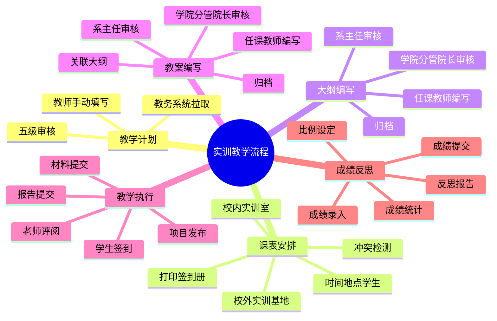

# 实训管理模块设计

## 1. 模块定位

| 项目 | 说明 |
|---|---|
| 管理对象 | 实训教学计划、课表安排、实训项目、大纲、教案、成绩、反思报告 |
| 场地 | 校内实训室为主，校外实训基地作为安排类型之一 |
| 组织方式 | 按课程、项目、班级和学生名单组织 |
| 复用能力 | 复用统一签到 `sign_in`、日志 `journal`、配对 `pair`、评阅意见 `review_opinion`、文件关系 `file_relation` |

## 2. 主流程

### 2.1 流程链路

```
实验实训教学计划
  → 实验实训课表安排
  → 大纲编写与审核
  → 教案编写与审核
  → 项目发布与教学执行
  → 成绩评定与统计
  → 教师反思报告
  → 归档
```

### 2.2 流程思维导图



## 3. 数据模型

> 所有表位于所属学校数据库中，无需 school_id 字段。

```
training_teaching_plan（实训教学计划）
  - id, uuid
  - source_type: edu_system / manual
  - course_code, course_name
  - grade_id, dep_id, profession_id
  - credit, total_hours, student_count
  - plan_content（JSON，保存教务数据和人工补充内容）
  - status: draft / wait / accept / modify / enabled / disabled
  - submitter_id（提交人 account.id）
  - created_at, updated_at, deleted_at

training_plan_approval（实训教学计划审核记录）
  - id, uuid, plan_id
  - approver_id
  - approval_level
  - level_name（系主任/学院教务科/学院主管院长/教务处/教务处领导）
  - opinion
  - status: accept / modify
  - created_at

training_schedule（实训课表安排）
  - id, uuid, plan_id
  - place_type: on_campus / off_campus
  - room_id（校内实训室，关联 training_room.id，可为空）
  - base_id（校外实训基地，关联 base.id，可为空）
  - teacher_id（任课教师）
  - date, start_time, end_time
  - location
  - student_count
  - status: draft / wait / accept / modify / published / cancelled
  - created_at, updated_at, deleted_at

training_schedule_class（实训课表-班级关联）
  - id, schedule_id
  - grade_id, dep_id, profession_id, class_id
  - student_count_snapshot
  - created_at, updated_at, deleted_at

training_project（实训项目）
  - id, uuid
  - plan_id, schedule_id
  - name, description
  - start_date, end_date
  - teacher_id（项目负责人）
  - status: draft / wait / accept / modify / published / completed
  - created_at, updated_at, deleted_at

training_project_class（实训项目-班级关联）
  - id, project_id, class_id
  - created_at, updated_at, deleted_at

training_room（实训室）
  - id, uuid
  - name, location, capacity
  - equipment（设备配置描述）
  - status: available / maintenance / disabled
  - created_at, updated_at, deleted_at

training_booking（实训室预约）
  - id, uuid, room_id, project_id, schedule_id
  - user_id（预约人）
  - date, start_time, end_time
  - status: draft / wait / accept / modify / cancelled
  - remark
  - created_at, updated_at, deleted_at

training_syllabus（实训大纲）
  - id, uuid, plan_id
  - title, content
  - file_id（附件 file.id）
  - version
  - status: draft / wait / accept / modify / archived
  - created_by
  - created_at, updated_at, deleted_at

training_lesson_plan（实训教案）
  - id, uuid, syllabus_id, project_id
  - title, content
  - file_id（附件 file.id）
  - version
  - status: draft / wait / accept / modify / archived
  - created_by
  - created_at, updated_at, deleted_at

training_material（实训材料）
  - id, uuid, project_id, student_id
  - title, content
  - template_id
  - files（关联 file_relation）
  - status: draft / wait / accept / modify
  - teacher_id（最近评阅教师，快捷引用；详细记录见 review_opinion）
  - created_at, updated_at, deleted_at

training_report（实训报告）
  - id, uuid, project_id, student_id
  - title, content, template_id
  - attachments（关联 file_relation）
  - status: draft / wait / accept / modify
  - teacher_id（最近评阅教师，快捷引用；详细记录见 review_opinion）
  - created_at, updated_at, deleted_at

training_score（实训成绩）
  - id, uuid, project_id, student_id
  - material_score, report_score, attendance_score
  - material_weight, report_weight, attendance_weight
  - final_score, teacher_id, comment
  - status: draft / submitted / confirmed
  - created_at, updated_at, deleted_at

training_reflection_report（实训反思报告）
  - id, uuid, plan_id, project_id
  - teacher_id
  - summary, problems, improvements
  - attachment_id（附件 file.id，可选）
  - status: draft / submitted / archived
  - submitted_at
  - created_at, updated_at, deleted_at
```

**说明：** 实训模块不独立建签到表和日志表。签到和日志统一使用 `sign_in` 和 `journal` 表，通过 `entity_type='training'` + `entity_id`（指向 `training_project.id`）关联。指导教师-学生关系复用 `pair` 表，`type='training'`，`arrangement_id` 指向 `training_project.id`。

## 4. 课表与预约规则

- 教学计划审核通过后才能生成课表安排。
- 课表安排支持校内实训室和校外实训基地两类场地。
- 校内安排必须校验实训室容量、实训室时间冲突、教师时间冲突、学生时间冲突。
- 校外安排必须维护基地、时间、地点和学生名单。
- 课表发布后可打印签到册。
- 时间冲突检测：同一实训室同一时段不可重复预约。
- 并发安全：预约写入时使用 Redis 分布式锁 `booking_lock:{room_id}:{date}:{start_time}`，TTL 10 秒。DB 层 `training_booking` 表增加唯一约束 `(room_id, date, start_time, end_time)` 兜底。
- 预约需审批（wait → accept / modify）。
- 预约取消：accept 后取消需管理员审批。

## 5. 大纲、教案与归档

- 大纲由任课教师编写，经过系主任、学院分管院长审核后归档。
- 教案必须关联已通过的大纲，由任课教师编写，经过系主任、学院分管院长审核后归档。
- 大纲和教案均需记录版本，退回修改后保留历史版本。
- 项目执行完成后，教师提交反思报告，作为教学质量改进和归档材料。

## 6. 成绩规则

- 成绩比例由任课教师按大纲设置，可包含考勤、材料、报告等项目。
- 成绩按学生和实训项目记录。
- 成绩提交后进入统计，管理员可按届次、学院、专业、班级、项目查看。
- 成绩确认后原则上不可直接覆盖，需走更正流程并留痕。
