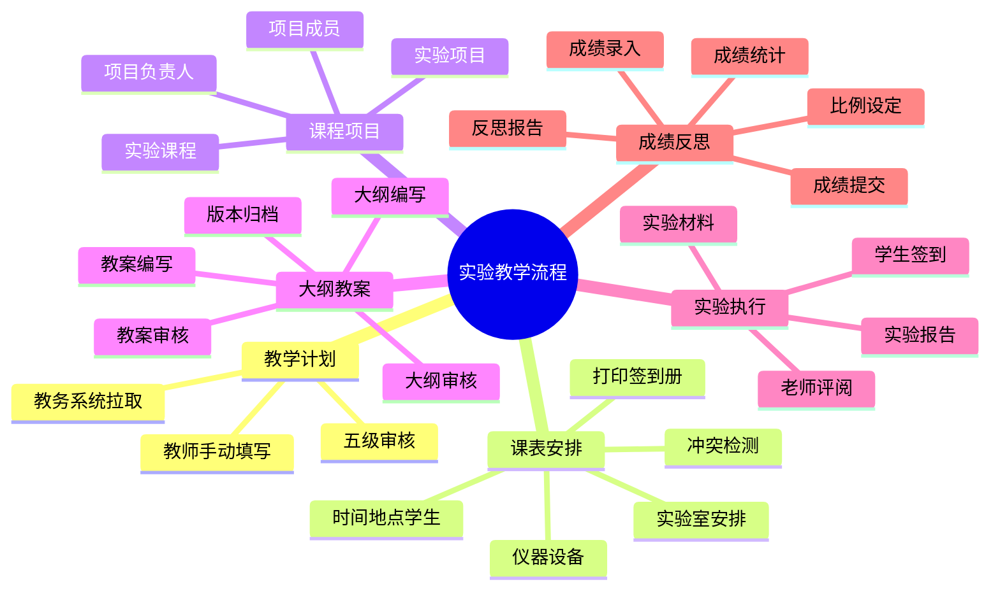

# 实验管理模块设计

## 1. 模块定位

| 项目 | 说明 |
|---|---|
| 管理对象 | 实验教学计划、实验课表、实验课程、实验项目、大纲、教案、成绩、反思报告 |
| 场地 | 校内实验室为主，需维护实验室容量和设备/仪器信息 |
| 组织方式 | 按课程、项目、班级、学生或小组组织 |
| 复用能力 | 复用实训预约规则、统一签到 `sign_in`、日志 `journal`、配对 `pair`、评阅意见 `review_opinion`、文件关系 `file_relation` |

## 2. 主流程

### 2.1 流程链路

```
实验实训教学计划
  → 实验课表安排
  → 实验课程与项目发布
  → 大纲编写与审核
  → 教案编写与审核
  → 实验执行
  → 成绩评定与统计
  → 教师反思报告
  → 归档
```

### 2.2 流程思维导图



## 3. 数据模型

> 所有表位于所属学校数据库中，无需 school_id 字段。

```
lab_teaching_plan（实验教学计划）
  - id, uuid
  - source_type: edu_system / manual
  - course_code, course_name
  - grade_id, dep_id, profession_id
  - credit, total_hours, student_count
  - plan_content（JSON，保存教务数据和人工补充内容）
  - status: draft / wait / accept / modify / enabled / disabled
  - submitter_id（提交人 account.id）
  - created_at, updated_at, deleted_at

lab_plan_approval（实验教学计划审核记录）
  - id, uuid, plan_id
  - approver_id
  - approval_level
  - level_name（系主任/学院教务科/学院主管院长/教务处/教务处领导）
  - opinion
  - status: accept / modify
  - created_at

lab_room（实验室）
  - id, uuid
  - name, location, capacity
  - equipment（设备/仪器配置描述）
  - status: available / maintenance / disabled
  - created_at, updated_at, deleted_at

lab_course（实验课程）
  - id, uuid, plan_id
  - name, description
  - teacher_id（课程负责人）
  - start_date, end_date
  - status: draft / wait / accept / modify / published / completed
  - created_at, updated_at, deleted_at

lab_course_class（实验课程-班级关联，中间表）
  - id, course_id
  - grade_id, dep_id, profession_id, class_id
  - student_count_snapshot
  - created_at, updated_at, deleted_at

lab_schedule（实验课表安排）
  - id, uuid, plan_id, course_id
  - room_id（实验室）
  - teacher_id（任课教师）
  - date, start_time, end_time
  - location
  - student_count
  - status: draft / wait / accept / modify / published / cancelled
  - created_at, updated_at, deleted_at

lab_project（实验项目）
  - id, uuid, course_id, schedule_id
  - name, description
  - teacher_id（项目负责人）
  - status: draft / wait / accept / modify / published / completed
  - created_at, updated_at, deleted_at

lab_project_member（实验项目-成员关联，中间表）
  - id, project_id, student_id
  - role: leader / member
  - created_at, updated_at, deleted_at

lab_booking（实验预约）
  - id, uuid, room_id, project_id, schedule_id
  - user_id（预约人）
  - date, start_time, end_time
  - status: draft / wait / accept / modify / cancelled
  - remark
  - created_at, updated_at, deleted_at

lab_syllabus（实验大纲）
  - id, uuid, plan_id, course_id
  - title, content
  - file_id（附件 file.id）
  - version
  - status: draft / wait / accept / modify / archived
  - created_by
  - created_at, updated_at, deleted_at

lab_lesson_plan（实验教案）
  - id, uuid, syllabus_id, project_id
  - title, content
  - file_id（附件 file.id）
  - version
  - status: draft / wait / accept / modify / archived
  - created_by
  - created_at, updated_at, deleted_at

lab_material（实验材料/指导书）
  - id, uuid, project_id, student_id
  - title, content
  - template_id
  - files（关联 file_relation）
  - status: draft / wait / accept / modify
  - teacher_id（最近评阅教师，快捷引用；详细记录见 review_opinion）
  - created_at, updated_at, deleted_at

lab_report（实验报告）
  - id, uuid, project_id, student_id
  - title, content, template_id
  - attachments（关联 file_relation）
  - status: draft / wait / accept / modify
  - teacher_id（最近评阅教师，快捷引用；详细记录见 review_opinion）
  - created_at, updated_at, deleted_at

lab_score（实验成绩）
  - id, uuid, project_id, student_id
  - material_score, report_score, attendance_score
  - material_weight, report_weight, attendance_weight
  - final_score, teacher_id, comment
  - status: draft / submitted / confirmed
  - created_at, updated_at, deleted_at

lab_reflection_report（实验反思报告）
  - id, uuid, plan_id, course_id, project_id
  - teacher_id
  - summary, problems, improvements
  - attachment_id（附件 file.id，可选）
  - status: draft / submitted / archived
  - submitted_at
  - created_at, updated_at, deleted_at
```

**说明：** 实验模块不独立建签到表和日志表。签到和日志统一使用 `sign_in` 和 `journal` 表，通过 `entity_type='lab'` + `entity_id`（指向 `lab_project.id`）关联。指导教师-学生关系复用 `pair` 表，`type='lab'`，`arrangement_id` 指向 `lab_project.id`。

## 4. 课表与预约规则

- 教学计划审核通过后才能生成实验课表。
- 实验课表必须绑定实验室、时间、教师和学生范围。
- 系统需要校验实验室容量、实验室时间冲突、教师时间冲突、学生时间冲突。
- 涉及设备/仪器的项目，需在课表或项目中记录设备要求。
- 课表发布后可打印签到册。
- 实验预约复用实训预约规则，`lab_booking` 表增加唯一约束 `(room_id, date, start_time, end_time)`。
- 支持按课程排课生成预约时段，教师可查看本课程全部预约。

## 5. 大纲、教案与归档

- 大纲由任课教师编写，经过系主任、学院分管院长审核后归档。
- 教案必须关联已通过的大纲，由任课教师编写，经过系主任、学院分管院长审核后归档。
- 大纲和教案均需记录版本，退回修改后保留历史版本。
- 实验结束后，教师提交反思报告，作为教学质量改进和归档材料。

## 6. 项目与成绩规则

- 项目挂在实验课程下，可由课程负责人指派项目负责人。
- 项目成员从课程班级学生中选择，通过 `lab_project_member` 中间表管理，支持 leader / member。
- 成绩比例由任课教师按大纲设置，可包含考勤、材料、报告等项目。
- 成绩按学生和实验项目记录。
- 成绩确认后原则上不可直接覆盖，需走更正流程并留痕。
