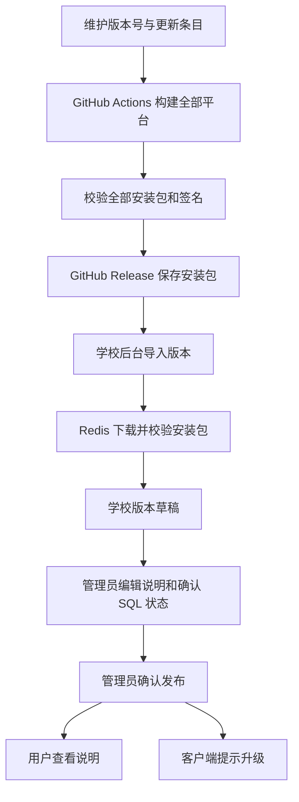

# 共享收藏与客户端版本发布设计

日期：2026-09-10。状态：供确认，尚未修改实现代码、数据库或已发布客户端。

## 已核对的实现

- 收藏由 `FavoriteController` 调用 `TableRecord`，`favorite_link` 目前仅支持个人账号所有权；桌面引用保存在 `user_desktop_shortcut`。
- PC 收藏、桌面和启动台沿用同一收藏来源；点击外链调用 `window.open`，Tauri 当前将所有站外页面交给系统浏览器。
- `ConfigController` 的学校配置由 `super_admin`、`school_admin` 管理，学院和专业管理员没有学校配置权限。
- 文件系统已有文件实体、引用、权限校验及临时文件回收；Redis 队列已有按学校初始化上下文、领取任务和记录失败的处理方式。
- 当前客户端为 `0.1.0`，没有 updater 插件和更新签名公钥。GitHub 仓库为私有仓库，尚未配置 Actions Secrets。
- 当前 Actions 只构建 Windows/Linux；Mac 安装包由本机生成。此后所有桌面平台的安装包和升级包统一改为 Actions 生成。

## 权限与学校范围

下列范围沿用学校配置权限，作为本次建议默认值。

| 操作 | 超级管理员 | 学校管理员 | 学院/专业管理员、教师、学生 |
| --- | --- | --- | --- |
| 新增和修改自己的收藏 | 可以 | 可以 | 可以 |
| 发布、修改、取消全校共享收藏 | 可以 | 可以 | 不可以 |
| 使用全校共享收藏、添加至个人桌面 | 可以 | 可以 | 可以 |
| 维护、发布、撤回本校更新说明 | 可以 | 可以 | 不可以 |
| 导入和发布本校客户端版本 | 可以 | 可以 | 不可以 |
| 查看、复制本校业务库升级 SQL | 可以 | 可以 | 不可以 |
| 查看涉及主库的 SQL、配置技术凭据 | 可以 | 不可以 | 不可以 |

共享和版本数据保存在学校业务库。超级管理员在当前学校上下文内操作，不跨学校同步。后端同时检查角色和菜单按钮权限，隐藏按钮不作为权限校验手段。

## 共享收藏

1. 新增/编辑收藏增加“同步到全校”开关，仅向有权限的管理员显示。开启和关闭均二次确认，提示影响全校用户。
2. 共享项只有一条源记录，不向每个用户复制收藏。其他用户的收藏夹和启动台自动显示，标记“学校共享”；个人可添加到桌面或移除自己的桌面引用。
3. 共享项的标题、地址、图标和默认打开方式由学校管理员统一维护。其他用户不能修改或删除共享源项。
4. 原有个人收藏保持个人范围。关闭共享后恢复创建人的个人收藏；删除、停用或撤销共享后，其他人的桌面查询不再返回失效引用。
5. 保存接口返回明确的 `item.id`，PC 不再通过当前页标题和地址猜测保存的是哪条记录。保存后即时刷新收藏、启动台和桌面数据。
6. 收藏图标沿用文件引用管理，根据收藏可见性授权读取；不可因“共享图标”而开放其他业务附件。
7. 搜索继续分页，可筛选“全部 / 我的收藏 / 学校共享”。启动台使用独立可见项查询，不依赖收藏夹当前页的数据。

默认不强制把共享收藏铺到所有人的桌面，保留每个人的桌面布局。

## 客户端外部网页窗口

- 收藏增加默认打开方式：“客户端窗口 / 外部浏览器”。客户端默认在独立窗口打开；网页 PC 仍使用浏览器新标签页。
- 独立窗口提供后退、前进、刷新、当前域名、复制链接和“在浏览器打开”，可以调整大小、最小化和关闭。支持在菜单中切换为外部浏览器打开当前地址。
- 收藏卡片和桌面快捷方式复用统一链接打开入口；不把网页判断、默认方式和窗口逻辑分别写在多处。
- 外部网页不注入学校上下文、不获得 Rust IPC、更新安装、文件系统等原生权限，也不继承本系统 JWT。外部网站自行登录。
- 只允许 HTTP/HTTPS 网页；不允许外部窗口导航到本机客户端通信入口或 `tauri:`、`file:` 等特权地址。邮件等已支持协议继续交给系统应用。
- 外部网站的新窗口和登录跳转在外部浏览上下文中处理；学校材料预览、打印和下载仍沿用学校专用窗口，不改变现有鉴权。
- 教务系统若限制嵌入式浏览器登录，用户可在同一窗口选择“在浏览器打开”。不承诺复制两个浏览器之间的登录状态。

## 更新说明与 SQL

系统配置新增“版本与更新”，使用列表和编辑弹窗，下设“更新说明”“客户端版本”；SQL 在管理员版本详情的独立页签中查看。

每个版本保存产品类型（系统/客户端）、版本号、标题、面向用户的富文本说明、来源提交、发布时间、操作人和修订号。状态为“草稿 / 已发布 / 已撤回”。

- 管理员打开版本管理时，自动扫描随服务端部署的版本清单并幂等导入系统版本草稿；客户端更新随选定的 GitHub Release 元数据导入。新版本自动填入说明草稿，同一版本重复导入不重复新增，也不覆盖管理员已编辑的内容。
- 初始说明由随版本提交的更新条目生成。没有条目时可以形成管理员待整理草稿，不把原始提交日志直接公布给用户。
- 自动导入不会发布，不发用户通知。管理员编辑后点击“发布”，二次确认；只有发布后，PC、H5 和客户端的“更新说明”入口才显示。
- 每个用户按学校、账号、版本记录已读提示状态，登录或回到前台时检查新说明，避免重复弹窗。保留更新历史入口。
- 已发布内容修改先保存新草稿，再次发布后更新用户可见内容；保存操作不直接修改线上说明或已发布状态。草稿内容与已发布快照分开存储。撤回不删除历史审计记录。
- 升级 SQL 单独保存在服务端迁移目录，并在管理员详情中按执行顺序展示文件名、目标库、前置版本、内容和 SHA256，提供复制按钮。
- 不提供在线执行任意 SQL 的接口。管理员在数据库工具中执行后，可登记“已执行”及备注；系统不把勾选状态表述为已验证数据库执行成功。
- 普通用户的列表、详情、更新检查、消息和安装包响应均不包含 SQL。SQL 不进入 PC/H5 编译产物或 GitHub 客户端 Release。
- 第一次安装此管理模块的建表 SQL 随服务端部署文档提供，先由管理员执行；模块不能依赖自身尚未创建的表来展示首次建表脚本。后续版本再由版本管理展示对应 SQL。
- SQL 内容和技术凭据不写入普通请求参数日志；审计保留查看、复制、登记、发布的操作名、版本、操作人及结果。

## GitHub 构建与学校发布

- GitHub Actions 增加 Mac 通用构建，保留 Windows x64、Linux x64。Mac 通用包同时服务 Intel 与 Apple Silicon，不再在本机打包发布。
- 普通代码推送进行构建；带版本标签或管理员手动发起的发布工作流，在全部平台完成后发布 GitHub Release。发布前可以暂存 GitHub 草稿，任一平台失败不把该版本标为正式完成。
- GitHub 包发布与学校内发布是两件事。前者只让管理员可以取得构建结果，不能直接触发学校用户的更新说明或升级提示。
- GitHub 私有仓库访问令牌仅保存在服务端环境配置，使用只读访问权限。客户端和普通用户不需要 GitHub 账号，不接收该令牌。
- 管理员选择 GitHub 版本后，服务端通过 Redis 异步下载到学校受控文件存储，记录进度、失败原因和校验状态，允许重试；HTTP 请求不等待大文件下载。
- 按仓库、Release ID、Asset ID 取文件，禁止传入任意下载 URL。重定向只允许 GitHub 受信下载域名，凭据不转发给签名文件地址。
- 保存安装包与升级包的版本、平台、架构、大小、SHA256、签名和源提交。重复导入复用相同文件，哈希不同则拒绝静默替换。
- 安装包作为正式版本引用，不标记为普通临时文件，不被定时临时文件清理误删。
- 发布前检查所选平台的包和签名齐全、状态完成，关联 SQL 是否已登记处理，版本高于当前版本。使用事务及修订号防止并发发布或重复点击。
- 发布后冻结安装包及签名，纠错通过新版本；允许撤回升级提示，但不强制用户降级。

## 客户端检查与覆盖升级

采用 Tauri 官方 updater，服务端决定对当前学校发布哪个版本，客户端使用编译内置的公钥校验升级签名。

仅下载普通安装器的方式实现较少，但每次都需要用户重新完成安装步骤；自行编写替换程序要维护平台差异和安装失败处理。本次建议使用官方 updater，deb 保留系统包管理器覆盖安装。

- 学校连接成功、应用回到前台和点击“检查更新”时检查，设置请求间隔，避免每次界面切换都请求。
- 升级检查仅返回当前学校已发布且适合本机平台/架构的版本，不返回草稿、SQL、服务器路径或 GitHub 凭据。没有可用更新返回 204。
- 下载通过学校服务端提供的限定版本和有效期的下载凭证完成；旧版、撤回版本或错误学校的凭证不能取得新下载授权。
- 提示包含当前版本、新版本、管理员发布说明、下载大小，以及“稍后 / 下载更新”。首版不强制升级、不自动安装。
- 下载显示进度和失败重试。安装前提示保存内容，并再次确认退出应用。校验失败停止安装，保留当前版本可用。
- 切换学校时取消旧学校的更新提示与下载任务；安装前重新核对当前学校和已发布版本，避免安装界面与当前连接不一致。
- 正式更新使用 HTTPS；本机 HTTP 仅用于开发环境接口核对，不全局关闭 HTTPS 或签名校验。

| 平台 | 覆盖方式 |
| --- | --- |
| Windows | Tauri 调用同一应用标识和安装目录的 NSIS 安装器，以进度界面覆盖升级；尽量采用用户目录安装。是否弹出系统权限提示取决于旧版安装位置。 |
| macOS | 使用签名的 `.app.tar.gz` 升级包替换应用并重启；首次 DMG 安装后应从“应用程序”运行。无写权限或从 DMG 运行时提示手动覆盖，不先卸载。 |
| Linux AppImage | 替换当前可写 AppImage 并重启，保留配置目录。 |
| Linux deb | 下载新版 deb，调用系统安装方式覆盖升级，不把 deb 安装的软件按 AppImage 替换。可能需要管理员权限。 |

保留当前应用标识、学校配置目录和业务数据；不执行卸载后重装，不主动清理用户设置。会话仍沿用既定规则，客户端重启后可能需要重新登录。

`v0.1.0` 没有更新检查与安装逻辑，因此需手动覆盖安装一次带 updater 的新版本，之后才能收到并执行上述在线升级。

## 签名与凭据

- 新增独立的 Tauri 更新签名密钥，私钥保存至 GitHub Actions Secret，公钥随客户端编译；私钥不进入 Git、安装包、服务器响应或输出日志。
- 密钥保留本机受限权限备份，后续版本沿用同一密钥，不能每次构建重新生成。GitHub 构建失败时不得以跳过签名的方式继续发布升级包。
- 更新签名不等于 Apple Developer 签名、公证或 Windows 代码签名。未配置系统签名证书时，不能承诺无 Gatekeeper/SmartScreen 提示。
- 服务端 GitHub 只读令牌需要在部署环境配置；不把开发机现有的高权限 Git 凭据直接写入学校服务器或客户端。

## 数据结构与代码位置

保持学校独立业务库；不在主库保存本次业务数据。新增/变更结构建议如下，实际 SQL 随实现单独提供。

| 表 | 变更或用途 |
| --- | --- |
| `favorite_link` | 增加共享范围、默认打开方式、最后操作人和修订号；保留创建人的归属。 |
| `system_release` | 系统/客户端版本、管理员草稿内容、已发布内容、来源哈希、发布状态和审计字段；产品类型与版本号唯一。 |
| `system_release_sql` | 管理员 SQL 文件内容、目标库、顺序、哈希、前置版本和人工执行登记；关联版本。 |
| `desktop_release_asset` | 关联版本的平台包、用途、源资产、下载状态、签名、SHA256 和正式文件引用。 |

已读提示首版复用按学校及账号隔离的前端本地记录，不因此新增用户已读表。需要跨设备已读同步时再扩展。

- 后端新增 `app/model/channel/FavoriteRecord.php`、版本相关 Model；查询和更新条件全部在 Model 方法中，Controller 负责入参及响应，`app/server` 负责权限、事务和流程编排。
- 收藏从 PC `App.vue` 提取到独立组件和 composable；桌面、启动台复用统一的可见收藏及打开方法。
- 更新管理复用现有列表、弹窗、富文本和开关组件；PC/H5 共用面向用户的更新接口，客户端升级只在桌面端显示。
- Rust 新增外部窗口和更新模块，升级命令只由本地可信窗口触发，外部网页不具备更新能力。
- 沿用 Webman 默认路由，仅修改本项目应用控制器和必要的应用认证白名单，不修改框架或 vendor 代码。
- 每个新接口补充用途注释与 `OperationLog`，涉及 SQL 和凭据的日志仅记录脱敏元数据。

## 实施顺序

1. 共享收藏、图标读取权限、桌面引用与统一链接入口。
2. 外部网页独立窗口和浏览器打开切换。
3. 版本、说明、SQL 结构及后台草稿/发布管理，PC/H5 更新说明入口。
4. GitHub 全平台构建、稳定签名和版本产物清单。
5. 服务端异步下载、正式文件引用、发布接口及客户端覆盖升级。
6. 更新操作说明，提交并推送 Gitea 主分支；GitHub 仅同步客户端所需代码及说明，SQL 留在完整服务端仓库。

技术依据：[Tauri Updater](https://v2.tauri.app/plugin/updater/)、[tauri-action](https://github.com/tauri-apps/tauri-action)。
