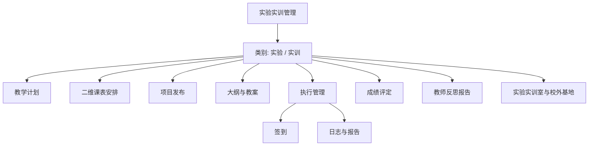

# 实验实训一体化与二维课表设计

## 1. 目标与范围

实验管理和实训管理合并为“实验实训管理”模块。所有业务记录保留在学校业务库中，使用 `module_type` 区分：

| 值 | 页面显示 | 说明 |
|---|---|---|
| `lab` | 实验 | 实验课程、实验项目、实验室执行记录 |
| `training` | 实训 | 实训课程、实训项目、实训室或校外基地执行记录 |

本次改造范围：

- PC 桌面和 H5 只保留一个“实验实训”入口。
- 教学计划、课表安排、项目、大纲、教案、成绩、反思报告、场地统一在一个模块管理。
- 所有可写业务记录必须选择实验或实训类别。
- 课表按届次、学院、专业编排，专业是课表归属和冲突校验的主维度。
- 课表安排以“横向星期、纵向课节”的周视图作为默认操作界面。
- 课表按具体日期保存，不实现跨周自动重复排课。
- 不删除已有 `practice_*` 表和实验、实训业务记录。

不在本次范围内：

- 多周重复排课与批量生成课表。
- 学期、学年维度。
- 旧接口兼容层。

## 2. 模块结构

所有列表和详情均显示类别标签。列表默认按当前账号的数据范围查询：届次为当前届次；学院管理员和专业管理员自动限定本人学院、专业；教师仅查看本人负责或指导的数据；学生仅查看本人参与的数据。

## 3. 数据模型

### 3.1 保留的统一业务表

以下表继续使用，不进行表名或业务数据迁移：

- `practice_plan`
- `practice_schedule`
- `practice_project`
- `practice_project_student`
- `practice_syllabus`
- `practice_lesson_plan`
- `practice_grade_rule`
- `practice_room`
- `practice_score`
- `practice_reflection`
- `practice_recording`

`practice_schedule`、`practice_project`、`practice_project_student`、`practice_score` 和执行记录均保留 `module_type`。新建、编辑、查询和导出必须传递该字段；跨类别的管理列表可以选择“全部”。

### 3.2 全局课节配置

新增 `practice_period` 表，供全校实验实训课表共用：

| 字段 | 类型 | 说明 |
|---|---|---|
| `id` | bigint unsigned | 主键 |
| `uuid` | char(36) | 唯一标识 |
| `name` | varchar(60) | 课节名称，如“第 1 节”或“1-2 节” |
| `start_time` | time | 课节开始时间 |
| `end_time` | time | 课节结束时间 |
| `sort` | int | 课表纵向排序 |
| `status` | enabled / disabled | 启用状态 |
| `created_at` / `updated_at` / `deleted_at` | datetime | 审计字段 |

课节由学校管理员或超级管理员在系统配置中维护。已被课表引用的课节不可物理删除，只能停用；停用课节仍可在历史课表中显示。

首次初始化预置以下通用课节。白天默认 8 节，晚上默认 4 节；学校管理员可按本校作息修改名称、时间、排序和启用状态：

| 课节 | 开始时间 | 结束时间 |
|---|---:|---:|
| 第 1 节 | 08:30 | 09:15 |
| 第 2 节 | 09:20 | 10:05 |
| 第 3 节 | 10:25 | 11:10 |
| 第 4 节 | 11:15 | 12:00 |
| 第 5 节 | 14:00 | 14:45 |
| 第 6 节 | 14:50 | 15:35 |
| 第 7 节 | 15:55 | 16:40 |
| 第 8 节 | 16:45 | 17:30 |
| 第 9 节 | 18:30 | 19:15 |
| 第 10 节 | 19:20 | 20:05 |
| 第 11 节 | 20:15 | 21:00 |
| 第 12 节 | 21:05 | 21:50 |

### 3.3 课表字段扩展

`practice_schedule` 新增以下字段：

| 字段 | 说明 |
|---|---|
| `period_start_id` | 起始课节，关联 `practice_period.id` |
| `period_end_id` | 结束课节，关联 `practice_period.id` |

现有 `schedule_date` 继续作为具体排课日期。`start_time`、`end_time` 在保存时由课节自动写入，作为历史时间快照；即使以后调整全局课节，已排课程的实际时间不变化。

一条课表安排可以覆盖连续多个课节。起始、结束课节必须启用且结束课节排序不小于起始课节排序。

## 4. 二维课表

### 4.1 周视图

用户必须先选择届次、学院和专业，再选择某一天。系统计算该日期所在周的周一至周日，横向列为星期和具体日期，纵向行为启用的全局课节。学院管理员和专业管理员默认锁定本人可管理范围，教师按本人授课范围查看。

每个课程块包含：

- 课程或计划名称。
- 实验或实训类别。
- 任课教师。
- 场地或基地。
- 班级或学生人数。
- 起止课节。

课程块从起始课节开始显示，按跨越课节数占用连续行。类别采用清晰但不依赖颜色的文字标签，避免同一颜色表达多种业务状态。

### 4.2 新增和编辑

点击空白单元格打开“编辑课表安排”弹窗，自动带入：

- 排课日期。
- 起始课节和结束课节。

弹窗包含以下字段：

- 类别：实验或实训，必填。
- 标题、关联计划、课程名称。
- 届次、学院、专业，均为课表必填归属。
- 任课教师。
- 场地类型、实验实训室或校外基地、地点。
- 学生数。
- 起始课节、结束课节。
- 启用状态。

点击已有课程块打开同一弹窗编辑。列表视图仍提供多条件筛选、详情、导出和批量操作，不与二维课表并列展示。

### 4.3 冲突规则

同一日期、时间区间重叠时，以下任一资源重复即拒绝保存：

- 同一任课教师。
- 同一届次、同一专业。
- 同一校内实验实训室。
- 同一校外基地。

时间区间由课节快照计算；区间边界相接但不重叠的课程允许连续安排。保存操作沿用事务和 Redis 锁，防止并发排入同一时段。

## 5. 权限、菜单与接口

### 5.1 权限

旧权限码 `training:view`、`training:manage`、`training:approve`、`lab:view`、`lab:manage`、`lab:approve` 全部下线，统一使用：

- `practice:view`
- `practice:manage`
- `practice:approve`
- `practice:period:manage`

`practice:period:manage` 只授予超级管理员和学校管理员。其余权限继承现有数据范围，类别不是新的数据范围层级。

### 5.2 菜单

根菜单“实训管理”改名为“实验实训管理”，原实验管理根菜单及所有子菜单软删除。统一模块保留：

1. 教学计划
2. 课表安排
3. 项目发布
4. 大纲编写
5. 教案编写
6. 成绩评定
7. 反思报告
8. 场地管理

系统配置新增“课节配置”菜单。PC 桌面默认显示“实验实训管理”；H5 底部导航只显示一个“实验实训”入口。

### 5.3 接口

新增 `PracticeController`，通过 Webman 默认路由提供 `/api/practice/*`。接口使用 `module_type` 识别类别，读接口允许 `all`，写接口必须为 `lab` 或 `training`。

删除以下控制器及其默认路由：

- `TrainingController` 和 `/api/training/*`
- `LabController` 和 `/api/lab/*`

不修改框架代码和路由配置。

## 6. 前端呈现

### 6.1 PC

- 桌面、启动台和窗口标题只显示“实验实训管理”。
- 模块顶部固定显示模块名称、类别筛选和操作说明。
- “课表安排”默认进入周视图，可切换到列表视图。
- 课节配置使用列表与弹窗编辑，不将编辑表单常驻在页面。
- 下拉框、开关、弹窗和操作按钮复用现有通用组件。

### 6.2 H5

- 底部导航从“实训”“实验”改为“实验实训”。
- 学生和教师页面以本人参与的项目为主，卡片显示类别、日期、课节和场地。
- 管理角色可查看周课表；小屏以按日期分组的课节列表呈现，不强制缩放二维表格。
- 学生、教师不显示全校课表筛选条件。

## 7. 迁移规则

1. 初始化脚本创建课节配置表并写入白天 8 节、晚上 4 节的可维护默认数据。
2. 初始化脚本为 `practice_schedule` 增加课节字段，不修改历史记录的 `module_type`、日期和时间。
3. 历史课表在没有课节关联时，根据其原开始、结束时间显示；重新编辑后补齐课节关联。
4. 菜单初始化将原实训菜单更新为统一菜单，将原实验菜单和关联角色菜单软删除。
5. 角色菜单初始化将旧实验、实训权限替换为统一权限，保留用户原有可访问范围。
6. 删除旧控制器、旧前端入口和旧 API 调用，不保留兼容转发。

## 8. 实施约束

- 使用 PHP 8.4 和 Webman 默认路由。
- 所有查询条件封装在 Model 方法中，Controller 和 Service 不直接拼接查询条件。
- 后端代码位于 `server`，PC 位于 `fontend/pc`，H5 位于 `fontend/h5`。
- 不恢复学期和学年概念，统一使用届次。
- 课表、保存、审核和变更操作继续写入 `recording` 与操作日志。
- 前端构建产物同步到 `server/public/pc` 与 `server/public/h5`。
